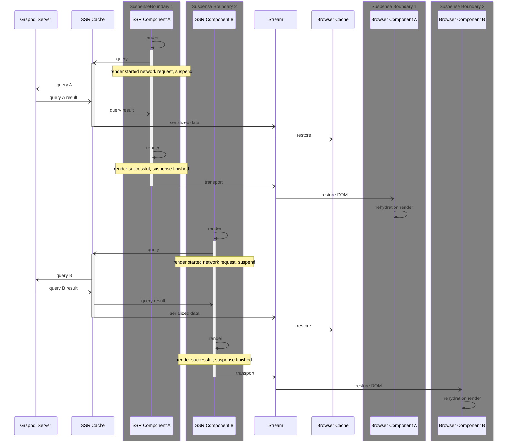
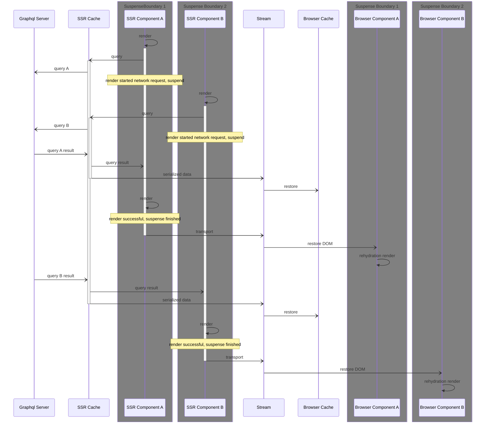
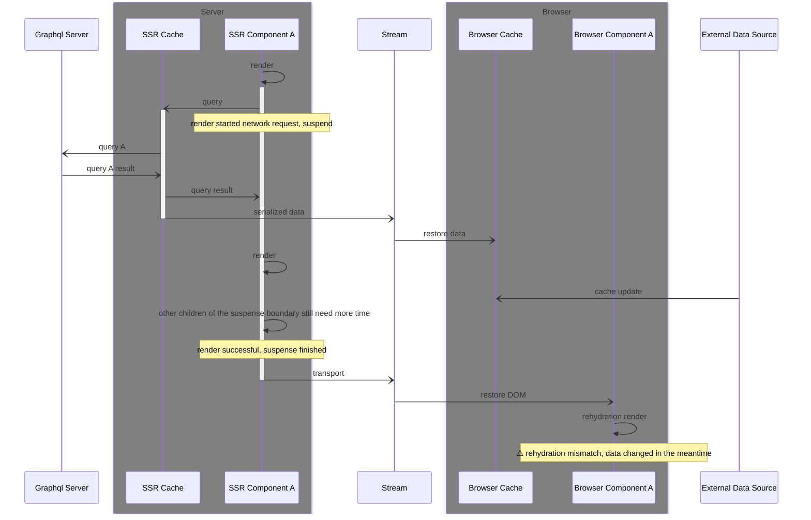
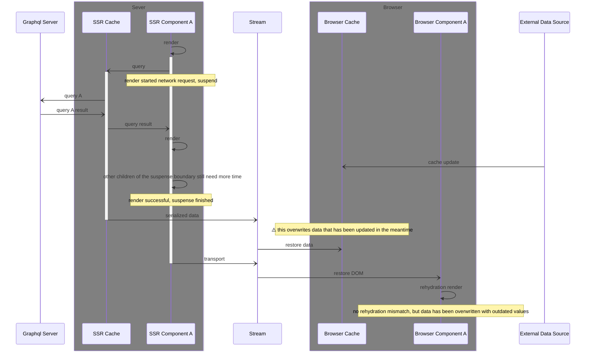

# The React Server Component & "SSR with Suspense" story

## Introduction: What are React Server Components?

RSC are a new technology that is currently landing in frameworks like Nextjs and Gatsby. Remix is currently experimenting with it, Dai-Shi Kato is currently building the experimental Framework [`wakuwork`](https://github.com/dai-shi/wakuwork) with it. (This one could be the best way to read into internals.)

Here I'll be mostly talking about NextJs, as that is the most mature implementation of RSC we are seeing so far (and also the one what will probably be adopted by users first, given the messaging around the NextJS `app` directory).

In a RSC environment, the root component is a "server component". 

Server components are marked with a `"use server"` pragma at the top of the file, while client components are marked with a `"use client"` pragma.
This is only strictly necessary for components that designate "boundaries" - so children of server components will be rendered as server components, and children of client components will be rendered as client components - even if they are imported from other files that don't have any pragma.

A server component can have server components and client components as children. This can be used to pass props from server components to client components, while it is a strict rule that these "over the boundary" props must be serializable. 
The only exception to this rule is that server components can pass JSX elements as props to client components (as `children`, but also as other props - think "named slots").

It is important to note that most hooks do not work in server components: `useContext`, `useState`, `useEffect` and the likes will throw.  
On the other hand, server components can be `async` functions and can `await` promises. This is the preferred way to do data fetching in server components.

Client components cannot have server components as children, but they can make JSX Elements passed in by server components part of their own output. Those elements will be rendered on the server and are the rendered output of the server component will be inserted at the right place when rendering the client components. This allows some level of "interweaving" of server and client components. 
This makes it possible to have a client component high up in the tree that makes use of a client-only feature like a Context Provider, while still having multiple additional levels of server components before the real "client level" is reached.

> Notable exception: this is hackable - as presented [here by Dai-Shi](https://twitter.com/dai_shi/status/1631989295866347520) CC can contain RSC, but these hacks should be left reserved for routing libraries, not for everyday usage.

### How this could look like in a real render

Let's assume we have this tree.

```jsx
// Layout:
"use server"
<html lang="en">
  <body>
    {children} // Page will be inserted here by the router
  </body>
</html>
// Page
"use server"
<main>
  <h1>Hello World</h1>
  <ClientC foo={"test"}><SomeServerComponent>lalala</SomeServerComponent></ClientC>
</main>
// ClientC
"use client"
<article>
  Foo {foo}
  {children}
</article>
```
(Let's assume that `SomeServerComponent` just renders a `div` here...)

This will lead to two React trees being rendered on the server:

```jsx
// RSC render
<html lang="en">
  <body>
    <main>
      <h1>Hello World</h1>
      <SomePlaceHolderForClientStuff children={
        <div>lalala</div>
      } />
    </main>
  </body>
</html>

// Client Component render (this will also happen once on the server, but with "client rules"!)
<article>
  Foo {"test"}
  <SomePlaceholderForServerStuff />
</article>
```

Both trees can "see" boundaries of the other tree, but have no idea what is going on inside of that.

It is important to see that we have a unidirectional dataflow here: (serializable) props can flow from the RSC layer, but nothing can flow back from CC into RSC.


Those two trees will then be stitched back into "one" tree and be sent back to the client. Note that for these examples, I'm ignoring Suspense.

So this is the final HTML that will be sent to the browser:
```jsx
<html lang="en">
  <body>
    <main>
      <h1>Hello World</h1>
      <article>
        Foo {"test"}
        lalala
      </article>
    </main>
  </body>
</html>
```

That "stitched-together" tree will then be streamed to the client, rendered out and then rehydrated:

Client components will start "running" on the client, while server components remain "static" html. It is possible to request a rerender of RSC from the client - in that case, the client sends a request to the server, which can then either rerender the full tree, or in the future also selectively rerender parts of it.

### "interweaving" and context

This is just the most common example of "interweaving" users will face, so I want to point it out separately.

While RSC do not have Context, our hooks need Context, and we want to "open" that context as far up the tree as possible.
So, we need to remember that this pattern is possible:
```jsx
// Apollo.js
"use client"
export function Apollo(props) {
  const clientRef = useRef()
  if (!clientRef) clientRef.current = buildApolloClient()

  return <ApolloProvider client={clientRef.current}>{props.children}</ApolloProvider>
}
// Layout
"use server"
<html lang="en">
  <body>
    <Apollo>
      {children} // Page will be inserted here by the router
    </Apollo>
  </body>
</html>
```

This way, `{children}` can still be a server component, but all CC further down the tree can still access the context.

Note that doing `<ApolloProvider client={...}>` in a `"use server"` Layout is not possible, as `client` is non-serializable and cannot pass the RSC-SSR boundary (let alone the SSR-Browser boundary). It has to be created in a "client-only" file.


### The terms "client" and "server".

"Client" and "Server" are not very fitting terms here. 
* "Server components" could also already be rendered during build, locally or in CI, and not on a server.
* "Client components" also execute on the server (or wherever RSC are rendered), but differently than on the client (no execution of effects, no ability to rerender). 

So I'll use different words here:

* RSC - these are React Server components
* SSR pass: this is rendering of client components on the server
* browser rendering: this is rendering of client components on the browser

### NextJS specifics: "static" and "dynamic" renders.

Also, keep in mind that RSC can happen in different stages.
RSC renders in NextJS can either happen "statically" or "dynamically". Per default, NextJS will render all RSC (and the following SSR pass) statically at build time, but if you use "dynamic" features like `cache`, they will be skipped during the build and be rendered dynamically on the running server instead.

At this point, we see either "static" or "dynamic" RSC/SSR passes, but I assume that in the future, there is a possibility to have a "static" RSC outer layout, while a child page is rendered as "dynamic" RSC.

### Possible stages and capabilities

This leaves us with these five different stages, all which have different capabilities:

| Feature         | static RSC | static SSR | dynamic RSC | dynamic SSR | browser |
| --------------- | ---------- | ---------- | ----------- | ----------- | ------- |
| "use client"    | ❌         | ✅         | ❌          | ✅          | ✅      |
| "use server"    | ✅         | ❌         | ✅          | ❌          | ❌      |
| Context         | ❌         | ✅         | ❌          | ✅          | ✅      |
| Hooks           | ❌         | ✅         | ❌          | ✅          | ✅      |
| cookies/headers | ❌         | ❌         | ✅          | ❌          | ❌      |
| can rerender    | ❌         | ❌         | ❌          | ❌          | ✅      |

## Supporting RSC

The best way of using Apollo Client in RSC is to create an Apollo Client instance and call `await client.query` inside of an `async` React Server Component.

We want to make sure that the Apollo Client does not have to be recreated for every request, but we also don't necessarily want to share it between different requests, as the client could be accessing cookies in a dynamic render.

### Sharing the client between components

As RSC do not have access to Context, we need another way of creating this "scoped shared client" and passing it around.
There is no support for anything like this on the React side, but NextJS internally uses `AsyncLocalStorage` to pass the `headers` down scoped per request. 
[We can use that](https://github.com/apollographql/apollo-client-nextjs/blob/c622586533e0f2ac96b692a5106642373c3c45c6/package/src/rsc/registerApolloClient.tsx#L12) to achieve this goal in NextJs. 
But this is a NextJS internal and might not stay around in that form.

### getting data from RSC into the SSR layer

I've discussed this with Dan, and we agree that using the RSC cache to rehydrate the SSR cache mostly doesn't make sense:
The base assumption would be that there is something in the RSC cache that would be valuable for the SSR pass. If that were the case, the same data would be rendered by RSC and SSR/Browser components. But while the latter could update dynamically on cache updates, the former could not update without the client manually triggering a server-rerender.

**Instead, we should document and encourage that RSC and SSR/Browser components should not use overlapping data. If it is expected that data regularly changes during an application lifetime, it makes more sense for it to live solely in client components.**

#### Possible exception: statically priming the cache without rendering anything

In this case, a root component could prefetch data, snapshot it and pass a serialized version of it as a prop into the `Provider` component or something similar. But this is a very edge-case scenario.

## Usage scenario: streamed SSR & Suspense

As mentioned before, there is no isolated RSC run - RSC are always part of a larger SSR pass. The second half of that SSR pass renders the client components, and users expect to be able to use all features as they could in the Browser. Most users will likely not even be aware that their client components render on the server.

That means that we need to transparently move data from the server to the client while the server-side Apollo Client gets filled up during the SSR pass - and to inject that data into the browser-side Apollo Client before the rehydration happens.

This "data transport" problem has been solved in the past, and there are various strategies around that, but it was always centered around a "single-pass hydration" - rendering the full React tree (usually, multiple times until all data has been fetched in the background), then extracting cache data, moving it over, priming the browser cache and kicking off rehydration.

This doesn't work any more: when using RSC in a SSR scenario and with Suspense in the picture, we are talking about [Steaming SSR](https://beta.nextjs.org/docs/data-fetching/streaming-and-suspense). Content up to the next suspense boundary will be rendered, then moved over to the client and rehydrated.  
Once a suspense boundary resolves, the next chunk will me moved over and rehydrated, and so on.

We can no longer wait for Apollo Cache to get "full", but need to move data over as soon as it is available.

This diagram shows a simplified version of this with two components that each are in a suspense boundaries that (for whatever reason) do not have overlapping timing.  
In reality, these will overlap.



So, the same diagram with more realistic overlapping (this is still a pretty optimal case!):




Note that in both of these scenarios, all we *maybe* have control over on the SSR side is when to send data from the SSR Apollo Client instance to the stream/to the Apollo Client instance in the Browser.  
We could have the choice of either moving data over immediately when we receive it, or when the suspense boundary resolves.  
At this point in time, we can only do the latter, as React does not provide means of injecting into the stream at arbitrary points in time.

### How to get data over

#### NextJs option: `useServerInsertedHTML` (which is meant for CSS)

NextJS has the `useServerInsertedHTML` hook that allows components to dump HTML out, which will then be inserted into the DOM by `getServerInsertedHTML`. That code will be dumped out right before React starts rehydrating a suspense boundary.  

We are currently [using this mechanism](https://github.com/apollographql/apollo-client-nextjs/blob/c622586533e0f2ac96b692a5106642373c3c45c6/package/src/ssr/RehydrationContext.tsx#L52), although we use the inner `ServerInsertedHTMLContext` directly, as it gives us more control over how we inject data.

#### Generic option: pipe into the stream

This was Dans initial suggestion.

If we would get access to the `ReadableStream/PipeableStream` instance that is used to transfer data to the server, we could use that to inject data into the stream directly.

The big questions here are "how to get the stream from within React components", and "when to inject code to inject *between* React's renders" and both have no easy answer.  

There is a [relevant RFC](https://github.com/reactjs/rfcs/pull/219) for a `useStream` hook that would allow us to inject into the stream at arbitrary points in time - but it is not sure if that will ever make it into React.

Manual approaches seem, very hacky:

We could try to use `localAsyncStorage` to make a `injectIntoStream` function available to the React render, but that would require us to patch every framework to make that work. 

Also, once we have the stream we have the problem of identifying the "right moment" to inject things, so we don't collide with React while it streams things over.

Prior art to that is aparently somewhere in [unstubbable/mfng](https://github.com/unstubbable/mfng), but given the option of NextJS `ServerInsertedHTMLContext`, I didn't investigate this further. In the end, we want so offer our users a solution that doesn't need them to patch their framework.

#### What TanStack React Query does: wrapping the `Suspense` component.

*This is actually the solution that Dan liked the least of all possible options - he doesn't want libraries to wrap Suspense boundaries, and I get why.*

We could wrap the `<Suspense>` component into our own wrapper and tell users to use that one. Data that would need to be transported over the wire would then be rendered out into a `<script dangerouslySetInnerHTML={{ __html: "restore logic here" }} />` tag. The nice thing here is that we have a good synchronization to the component tree that we otherwise won't have.

### Problems of a client-side cache in a "streaming SSR" scenario

The general problem we have is that the client-side cache can change in the browser while the server is still rendering a Suspense Boundary. In the worst case, the server would render based on "past data" while the client already received an update and will try to render rehydrated data that is different from what the server rendered. We encounter a hydration mismatch.

In a "we can move data from SSR to the client" scenario, that would look like this


In our "we can only move data over from the server when the suspense boundary resolves" scenario, that would look like this. 
Note that here we do not only get a hydration mismatch, but we even have a "response from the past" overwrite "data from the future" in the cache. 



So we have two different problems here:

1. SSR-rendered components that move over to the browser have been rendered in the past and the browser has already "newer" data. We have to prevent a hydration mismatch.
2. Data that is moved over from the server to the browser has already been superseeded by newer data in the browser and threatens to overwrite data from the future. 

Both of these problems will happen with any client-side cache, but they are most prevalent with a normalized cache like Apollo Client, since here other, overlapping, requests can take the role of this "external data source".

We can solve these problems to varying degrees, so here are a few puzzle pieces:

* Both of these problems become more manageable if fewer requests happen within a suspense boundary. In an optimal world, each suspense boundary would only kick off one request. This is in line what the React team recommends anyways, to prevent waterfalls from happening.  
We can do a lot here by educating our users to use `useSuspsenseQuery` as few times as possible with a big query, composed of the fragments required by components further down the tree, and then using `useFragment`in those to access these fragments.  
This is already an important part of our Suspense.  
Generally, this will reduce the time from "query start" to "suspense boundary finished/data moves over" and won't make these things impossible, but a lot less likely.
* We could make the Apollo Cache "time-aware", so it would store a timestamp with each entity and make sure that older entities can never overwrite newer ones. This would solve the second problem, but not the first one.  
It would also require a full rewrite of the cache and bring a lot of new challenges, like accounting for time skew between client and server.
This is not something we realistically can do in the near future, but we should keep it in mind for the future when we want to make bigger changes to the Cache.
* We can work towards a solution where data can move over to the browser as soon as possible, and not only when suspense boundaries are flushed. This would reduce the second problem by a lot.
* We can snapshot each hook's value and not only move the query responses over to the cache, but also a "per-component-hook-usage" snapshot, using that for rehydration and then rerendering with the value from the browser client. This solves the hydration mismatch and [we are doing that in our current solution](https://github.com/apollographql/apollo-client-nextjs/blob/c622586533e0f2ac96b692a5106642373c3c45c6/package/src/ssr/hooks.ts#L9-L23).
* Users that want to completely eliminate 2., could use a `fetchPolicy` of `cache-and-network`, which would cause the query to be refetched in the browser, and the browser cache would then overwrite data from the past that in the meantime might have ended up in the cache. This is not a nice solution, but the nice thing is that it can be used as a "targeted workaround" for specific queries, where our users expect this to be a problem.

So, at this point we can eliminate problem 1., and we can reduce problem 2. to the point where it becomes unlikely. A future implementation of `injectIntoStream` on React or NextJs side would help us make it even more unlikely. (And users can overwhelm the problem with additional network requests if they deem it really necessary.) 

## Usage scenario: multipart queries

> If you are only interested in the React/NextJS side of things, you can skip this section. This is only relevant for people that want to use Apollo Client with SSR and want to use multipart queries.

React is not the only thing that does streaming. We also have streaming queries, which means that a GraphQL query can mark certain fragements as `@defer`ed, and the server can then send an initial chunk with with the non-deferred fields and then send all the deferred interfaces whenever they roll in. This is a very powerful feature, but it also means that we have a conflict with a paradigm of React SSR: if a component rendered for the first time, there is no way of updating it later - it will be streamed to the client and the client would have to care about those updates.

Now, we want to offer some flexibility here. We essentially have two "corner" cases:

* all deferred fragments come in within a few milliseconds of the initial query response. In this case, we can just await all fragements, render the component on the server and stream it to the browser.
* the deferred fragments come in much later, after the initial query response. In this case, we don't want to await all those fragments on the server, but send an incomplete render to the browser. The browser-side client can then re-execute that multipart query and await the deferred fragments, slowly rendering them once they come in.

The reality will probably be somewhere in-between. Some queries might have one deferred fragment, that's very slow to resolve, and some might have 10 deferred fragments that resolve very quickly. We want to be able to handle both of these cases in a nice way.

For this, we introduce two links that can be used server-side:

### The `RemoveMultipartDirectivesLink` 
It can be configured to remove all (or none) `@defer`-marked interfaces from a query before it is requested from the GraphQL server. It allows for exceptions to the rule. 
A developer could either set it to remove all deferred interfaces, but annotate a few "known fast" interfaces with `@defer(label: "SsrDontStrip")`. 
Alternatively, they could also set it to remove no deferred interfaces, but annotate a few "known slow" interfaces with `@defer(label: "SsrStrip")`.

### The `AccumulateMultipartResponsesLink`
The `useSuspenseQuery` hook is written in a way that it will immediately finish suspending the moment the initial query response comes in. So on it's own, even if deferred interfaces are still part of the query, React would already render the suspended component with the initial query response and stream the response to the server, ignoring any deferred interfaces that might come in later.  
For this use case, the `AccumulateMultipartResponsesLink` is used. Once the initial query response comes in, it will not forward it to the client, but wait for a configurable amount of time (`cutoffDelay`) for more chunks to come in. All chunks that come in during that timeframe will be merged into the initial response, and finally forwarded to the client.

Using both of these links together, developers have quite fine-grained control over multipart queries. They can choose which parts of their queries should be requested on the server, and how long it may take for deferred chunks to come in.  
If a query is "incomplete" after that, the client can re-execute the query in the browser wait for all the deferred fragments to come in.

This allows for a nice balance of "fast SSR" and "complete SSR" that can be configured on a per-case basis.