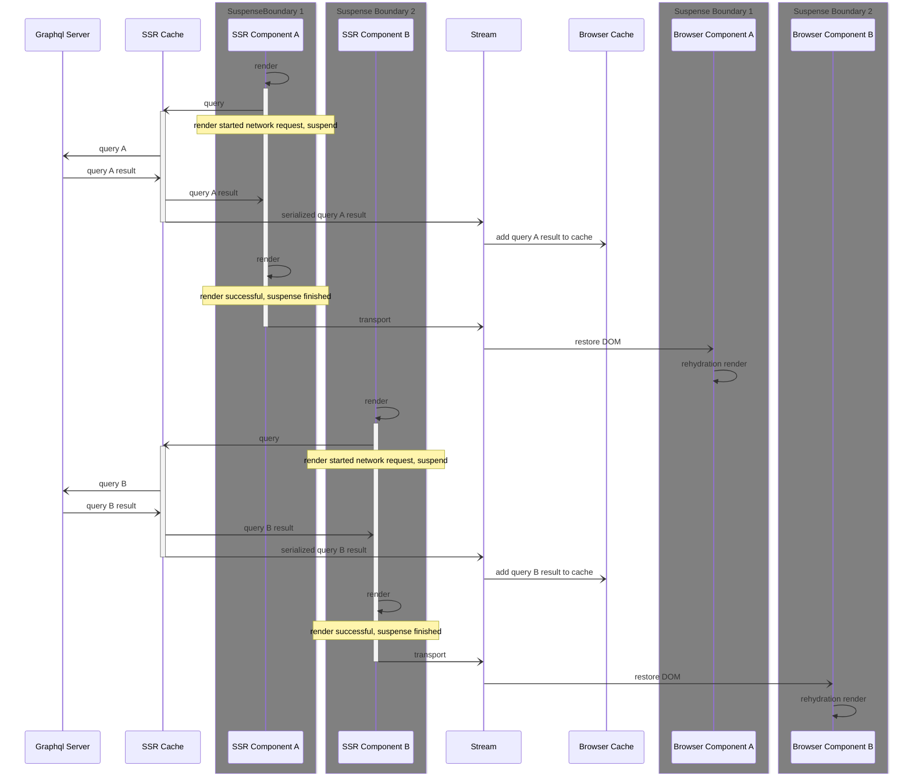
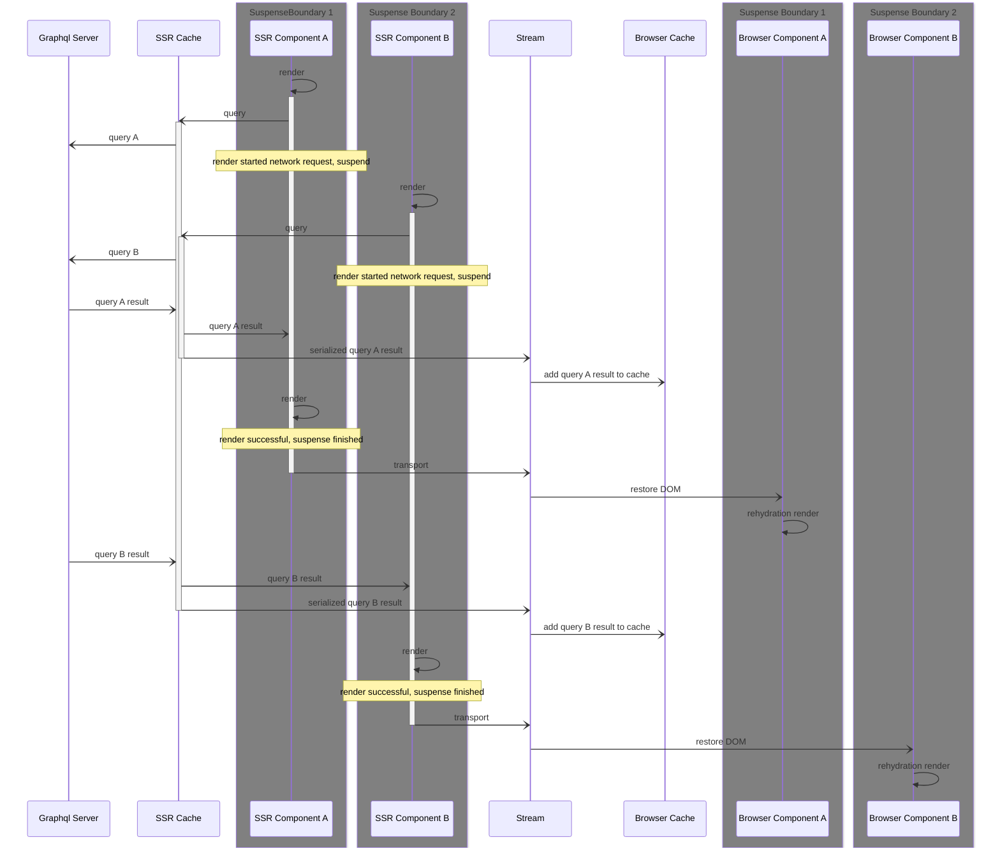
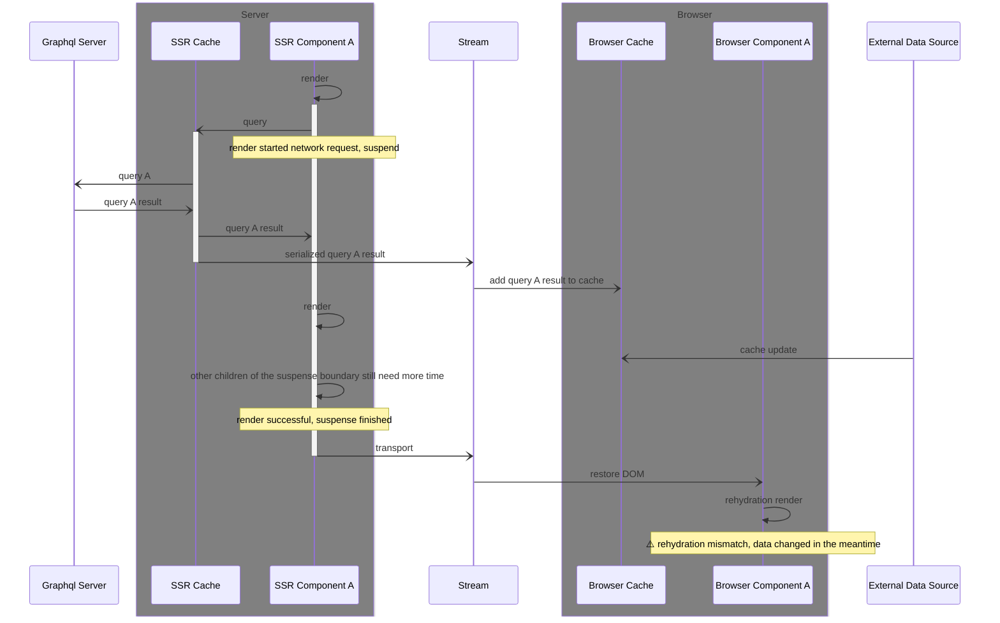

# The Next.js "App Router", React Server Component & "SSR with Suspense" story

> This RFC accompanies the release of a `@apollo/experimental-nextjs-app-support` package, which is created to supplement the `@apollo/client` package and add primitives to support React Server Components and SSR in the Next.js `app` directory.  
Please also see the full package README at the [repository](https://github.com/apollographql/apollo-client-nextjs).

## Introduction: What are React Server Components?

React Server Components (RSC) are a new technology that is currently landing in frameworks like [Next.js](https://nextjs.org/docs/advanced-features/react-18/server-components) and [Gatsby](https://www.gatsbyjs.com/docs/how-to/performance/partial-hydration/). Remix is currently experimenting with it, Dai-Shi Kato is currently building the experimental Framework [`wakuwork`](https://github.com/dai-shi/wakuwork) with it. (This one could be the best way to read into internals.)

In this RFC, I'll be referring to RSC in the context of Next.js, as that is the most mature implementation of RSC we are seeing so far and the one likely to be adopted by users first, given the messaging around the Next.js `app` directory.

In an RSC environment, the root component is a "server component". 

Imports from this root Server Component are treated as a Server Components too unless the imported file has a "use client" pragma. Components imported from such a file will be handled as Client Components - and all further components imported directly or indirectly from a "use client" file will also be handled as Client Components.
These pragmas are only necessary for files that designate a "boundary". Generally, files will inherit their "Serverness" or "Clientness" from the file that imports them.

A server component can render a mix of server components and client components as children, allowing server components to pass props to client components. It's important to note that any "over the boundary" props passed from server to client components **must** be serializable. However, there is one exception to this rule. Server components can pass JSX elements as props to client components, either as `children` or other props that accept JSX elements (i.e. "named slots").

It is important to note that most hooks do not work in server components: `useContext`, `useState`, `useEffect` and the likes will throw.  
On the other hand, server components can be `async` functions that can `await` promises. This is the preferred way to fetch data in server components.

In contrast, client components cannot directly import and render server components, or pass props to them. The reason for this is quite simple: All Server Components are evaluated before any Client Components are evaluated.  
Instead, they can use props to accept "server component JSX" from a parent server component (e.g. the `children` prop). This allows some level of "interweaving" between server and client components since server components can inject other server components as children to client components.
This makes it possible to have a client component high up in the component tree that makes use of a client-only feature, like a context provider, while allowing for multiple levels of server components before additional client components are rendered.

> Notable exception: as presented [here by Dai-Shi](https://twitter.com/dai_shi/status/1631989295866347520), CC can start a new RSC render tree, but this practice should be left reserved for routing libraries, not for everyday usage.

### An example interweaving client and server components

Note that for the sake of simplicity, the example did not contain suspense boundaries, which add another layer of complication.

Let's assume we have this tree.

```js
// Layout.js
export default function Layout() {
  return (
    <html lang="en">
      <body>
        {/* Page will be inserted here by the router */}
        {children}
      </body>
    </html>
  );
}

// Page.js

// this is imported from a Client file, so it will be handled as a Client Component
import { Collapsible } from "./Collapsible"; 

export default function Page() {
  return (
    <main>
      {/* a client component */}
      <Collapsible title="About the author">
        {/* // a server component */}
        <AuthorProfile />
      </Collapsible>
    </main>
  );
}

// Collapsible.js
"use client";

export function Collapsible({ title, children }) {
  const [collapsed, setCollapsed] = useState(false);
  return (
    <article>
      <h1>{title}</h1>
      {collapsed ? null : children}
      <button onClick={() => setCollapsed((v) => !v)}>{collapsed ? "expand" : "collapse"}</button>
    </article>
  );
}

// AuthorProfile.js
export async function AuthorProfile() {
  const { data } = await fetch("/api/author");
  return (
    <div>
      <h2>{data.name}</h2>
      <p>{data.bio}</p>
    </div>
  );
}

```

First, the React Server Component layer will render all React Server Components and leave the Client components unevaluated, returning this JSX:

```jsx
<html lang="en">
  <body>
    <main>
      {/* the client component is not evaluated yet */}
      <Collapsible title="About the author">
        <div>
          <h2>Some name</h2>
          <p>Lorem Ipsum</p>
        </div>
      </Collapsible>
    </main>
  </body>
</html>
```

This JSX can be handled in multiple ways:
* It could be kept around for later usage (e.g., if this was part of a build step), and one of the other options will later be used with it.
* It could be evaluated for an SSR pass on the server (e.g., on first page load) and be streamed to the browser as HTML, where the components will get hydrated.
* It could be transformed into a React-specific JSON format and sent to the browser, where it will be evaluated by the client component layer.

It is important to note that we have a unidirectional dataflow here: (serializable) props can flow from the RSC layer to Client Components, but nothing can flow from Client Components back into RSC. (We do not yet cover Server Actions, as these were released a few days ago as of writing this.)


Once hydrated, client components are fully executable and interactive, and will re-render in response to state updates. The output of server components does not change in response to state updates, but it is possible to request a re-render of RSC from the client imperatively (usually, by clicking a link or explicitly asking the RSC router to refetch the server output). To do so, the client sends a request to the server, which re-renders the RSC tree. An RSC router may also allow to re-render a part of the tree associated with a subroute. When server components re-render, their new output is merged into the existing client tree, so client state does not get lost.

### Interweaving client and server components when using React Context

We expect one of the most common usages of interweaving will be to use React's Context in a client component high up in the React tree.

While Apollo Client usage in RSCs does not use Context, we still need a Context Provider for our hooks that will be used in Client components. 
The most convenient way to provide that is to create a Client Component that "weaves" itself into the Server Component tree inside the Layout:
```jsx
// Apollo.js
"use client"

export function Apollo(props) {
  const clientRef = useRef()
  if (!clientRef) clientRef.current = buildApolloClient()

  return (
    <ApolloProvider client={clientRef.current}>
      {props.children}
    </ApolloProvider>
  );
}

// Layout.js
export default function Layout(){
  return (
    <html lang="en">
      <body>
        <Apollo>
          {children} // Page will be inserted here by the router
        </Apollo>
      </body>
    </html>
  )
}
```

This way, `{children}` can still be a server component, but all client components further down the tree are able to access the context.

Note that using `<ApolloProvider client={...}>` in a React Server Component is impossible, as `client` is non-serializable and cannot be passed from one environment into the next. As a result, the Apollo Client must be created in a Client file.

### The terms "client" and "server".

We should note that the terms "Client" and "Server" are a bit of a misnomer.
* "Server components" aren't strictly rendered on a running server. While this is one case, these components can also be rendered during a build (such as static generation), in a local dev environment, or in CI.
* "Client components" are the React components we have known for years. They aren't strictly run in the browser. These are also executed in an SSR pass on the server, with a subset of the capabilities they would have in the browser: Effects are not executed and there is no ability to rerender. Because of the different environments, the `window` object is not available.

In an effort to provide some clarity, I'll use the following terms:

* RSC - React Server components run on the server (either on a running server, or during a build)
* SSR pass - The render phase of client components on the server before the result is sent and hydrated in the browser
* Browser rendering - The rendering of client components in the browser

### Next.js specifics: "static" and "dynamic" renders.

RSC within Next.js can happen in different stages: either "statically" or "dynamically".
By default, Next.js will try to render both RSC and the SSR pass statically at build time. If you use "dynamic" features like `cookies`, they will be skipped during the build and instead be rendered on the running server.

At this point, we see either "static" or "dynamic" RSC/SSR passes, but I assume that in the future, there is a possibility to have a "static" RSC outer layout, while a child page is rendered as "dynamic" RSC.

## Apollo Client and RSC

The best way to use Apollo Client in RSC is to create an Apollo Client instance and call `await client.query` inside of an `async` React Server Components.

We want to make sure that the Apollo Client does not have to be recreated for every query, but we also don't necessarily want to share it between different requests, as the client could be accessing cookies in a dynamic render, so potentially sensitive data could be shared between multiple users on accident.

### Sharing the client between components

As React Server Components cannot access Context, we need another way of creating this "scoped shared client" and passing it around.
For this purpose, we use the `React.cache` API, which essentially behaves like a [per-request globally-scoped `useMemo` call](https://twitter.com/dan_abramov/status/1655216626608791555).

### Getting data from RSC into the SSR pass

I've discussed the possibility of using the RSC cache to rehydrate the SSR cache with [@gaearon](https://github.com/gaearon) and we agree that it mostly doesn't make sense.
The base assumption was that something in the RSC cache would be valuable for the SSR pass. If this were the case, the same data could be rendered by RSC and SSR/Browser components. But while the latter could update dynamically on cache updates, the former could not update without the client manually triggering a server-rerender.

**Instead, we should document and encourage that RSC and SSR/Browser components (i.e. client components) should not use overlapping data. If data is expected to change often during an application lifetime, it makes more sense for it to live solely in client components.**

### Library design regarding React Server Components

We will export a `registerApolloClient` function to be called in a global scope. This function will return a `getClient` function that can be used to get the correct client instance for the current request, or create a new one.

In the future, this could be configurable, so the client would be created per-request in dynamic rendering, but shared between pages in static rendering.

<details><summary>Toggle example usage:</summary>

```js
import { ApolloClient, HttpLink, InMemoryCache } from "@apollo/client";
import { registerApolloClient } from "@apollo/experimental-nextjs-app-support/rsc";

export const { getClient } = registerApolloClient(() => {
  return new ApolloClient({
    cache: new InMemoryCache(),
    link: new HttpLink({
      // this needs to be an absolute url, as relative urls cannot be used in SSR
      uri: "http://example.com/api/graphql",
      // you can disable result caching here if you want to
      // (this does not work if you are rendering your page with `export const dynamic = "force-static"`)
      // fetchOptions: { cache: "no-store" },
    }),
  });
});
```

You can then use that getClient function in your server components:
```jsx
const { data } = await getClient().query({ query: userQuery });
```
</details>

## Usage scenario: Streamed SSR & Suspense

As mentioned Client Components in Next.js will have a render pass on the server on the first page load.  
That is not really noticeable without using "fetch-in-render" suspense features, as the component render on the server was usually side-effect free.  
But with the `useSuspense` hook, the component will now fire a request during render, and suspend until it has data. This does not only happen in the Browser but also on the server.  
Where the SSR run was mostly inconsequential for the user (assuming they were not using other SSR-specific APIs) before, they now see different behavior, and we need additional functionality to support that. 
We now need a way to transparently move data from the server to the client while the server-side Apollo Client receives query responses during the SSR pass - and to inject that data into the browser-side Apollo Client before the rehydration happens.

With prior React versions that used synchronous rendering, the "data transport" problem has typically been solved using a "single-pass hydration" technique. In the case of [Apollo](https://www.apollographql.com/docs/react/performance/server-side-rendering), we would render the full React tree one or more times until all queries had successfully been fetched. Once fetched, we would extract all cache data then output that data with the final HTML. This would allow the browser to prime the client-side cache with the server data during hydration.

This technique does not work with RSC. React 18 enables [Steaming SSR](https://beta.nextjs.org/docs/data-fetching/streaming-and-suspense) with Suspense, which allows parts of your app to be streamed to the browser while React works on rendering other parts of your app on the server. Content up to the next suspense boundary will be rendered, then moved over to the client and rehydrated.  
Once a suspense boundary resolves, the next chunk will me moved over and rehydrated, and so on.

In this model, we can no longer wait for all queries to finish execution before we extract data from the Apollo Cache. Instead, we need to stream data to the client as soon as it is available.

To illustrate this, here is a diagram that represents two components with their own suspense boundaries that do not have overlapping timing - usually indicated by a waterfall situation.

JSX for that could be:

```jsx
// page.js
<Suspense>
  <ComponentA />
<Suspense>

// ComponentA.js
<Suspense>
  <ComponentB />
<Suspense>
```




Here is the same diagram with overlapping (this is still a pretty optimal case!):

The JSX for that could be:

```jsx
// page.js

<Suspense>
  <ComponentA />
<Suspense>
<Suspense>
  <ComponentB />
<Suspense>
```



In both of these scenarios, about the only control we have during the SSR pass is when to stream data from the SSR Apollo Client instance to the browser.  
Ideally we'd have the choice to either move data to the client immediately as we receive it, or as the suspense boundary resolves.
Unfortunately we can only do the latter, as React does not a mechanism of injecting data into the stream at arbitrary points in time.

### Approaches for transferring data from the server to the client

#### Option: Use Next.js `useServerInsertedHTML` hook (meant for CSS)

Next.js has a [`useServerInsertedHTML`](https://beta.nextjs.org/docs/styling/css-in-js#configuring-css-in-js-in-app) hook that allows components to dump arbitrary HTML into the stream, which will then be inserted into the DOM by `getServerInsertedHTML`. That code will be dumped out right before React starts rehydrating a suspense boundary.  

This is the [mechanism we're using](https://github.com/apollographql/apollo-client-nextjs/blob/c622586533e0f2ac96b692a5106642373c3c45c6/package/src/ssr/RehydrationContext.tsx#L52), though we use the inner `ServerInsertedHTMLContext` directly as it gives us more control over how we inject data.

#### Option: Pipe directly into the stream

This was [@gaearon](https://github.com/gaearon)'s initial suggestion.

If we would get access to the `ReadableStream/PipeableStream` instance that is used to transfer data to the server, we could use that to inject data into the stream directly.

The big questions here are "how to get the stream from within React components", and "when to inject code to inject *between* React's renders" and both have no easy answer.  

There is a [relevant RFC](https://github.com/reactjs/rfcs/pull/219) for a `useStream` hook that would allow us to inject into the stream at arbitrary points in time - but it is not sure if that will ever make it into React.

Manual approaches seem, very hacky:

We could try to use `localAsyncStorage` to make a `injectIntoStream` function available to the React render, but that would require us to patch every framework to make that work. 

Also, once we have the stream we have the problem of identifying the "right moment" to inject things, so we don't collide with React while it streams things over.

Prior art to that is aparently somewhere in [unstubbable/mfng](https://github.com/unstubbable/mfng), but given the option of NextJS `ServerInsertedHTMLContext`, I didn't investigate this further. In the end, we want so offer our users a solution that doesn't need them to patch their framework.

#### Option: Wrap the `Suspense` component.

Using this approach, we'd export a custom wrapped `<Suspense>` component and have users to use that one. Data transported over the wire would then be rendered out into a `<script dangerouslySetInnerHTML={{ __html: "restore logic here" }} />` tag. The benefit here is that we have good synchronization with the component tree that we otherwise wouldn't have.

Discussing this approach with [@gaearon](https://github.com/gaearon), he pointed out that he hopes that libraries don't have to wrap Suspense boundaries.  
Suspense boundaries should stay a "React primitive". If libraries started wrapping them, there would be the risk is that users would end up with multiple different libraries, each with their own "Suspense wrapper", and that users would have to choose the "right" one for each use case, making things a lot more complicated and error-prone.

### Challenges of a client-side cache in streaming SSR

The general problem we have is that the client-side cache can change in the browser while the server is still rendering a Suspense Boundary. Some possible reasons for that could be overlapping results coming in from other suspense boundaries on the server, or user interaction with already-rehydrated parts of the application in the Browser.
In the worst case, the server would render based on "past data" while the client already received an update and will try to render rehydrated data that is different from what the server rendered. We encounter a hydration mismatch.

If we had the ability to write directly to stream (using `injectIntoStream`), this might look like this:


In our `useServerInsertedHTML` scenario, where we can only move data over from the server when a suspense boundary resolves, that would look like this:
Note that here we will likely not get a hydration mismatch, but the stale data from the server now overwrites the updated cache. 


So we have two different problems here:

1. SSR-rendered components that move over to the browser have been rendered in the past and the browser has already "newer" data. We have to prevent a hydration mismatch.
2. Data that is moved over from the server to the browser has already been superseeded by newer data in the browser and threatens to overwrite data from the future. 

Both of these problems will happen with any client-side cache, but they are most prevalent with a normalized cache like Apollo Client, since here other, overlapping, requests can take the role of this "external data source".

We can solve these problems to varying degrees, so here are a few puzzle pieces:

* Both of these problems become more manageable if fewer requests happen within a suspense boundary. In an optimal world, within a suspense boundary (or, if possible, even per page) you would not fire off more than one query. This would already be a good practice anyways, to prevent waterfalls from happening.  
We can do a lot here by educating our users to use `useSuspsenseQuery` as few times as possible with a big query, composed of the fragments required by components further down the tree, and then using `useFragment`in those to access these fragments.  
This is already an important part of our Suspense.  
Generally, this will reduce the time from "query start" to "suspense boundary finished/data moves over" and won't make these things impossible, but a lot less likely.
* We could make the Apollo Cache "time-aware", so it would store a timestamp with each entity and make sure that older entities can never overwrite newer ones. This would solve the second problem, but not the first one.  
It would also require a full rewrite of the cache and bring a lot of new challenges, like accounting for time skew between client and server.
This is not something we realistically can do in the near future, but we should keep it in mind for the future when we want to make bigger changes to the Cache.
* We can work towards a solution where data can move over to the browser as soon as possible, and not only when suspense boundaries are flushed. This would reduce the second problem by a lot.
* We can snapshot each hook's value and not only move the query responses over to the cache, but also a "per-component-hook-usage" snapshot, using that for rehydration and then rerendering with the value from the browser client. This solves the hydration mismatch and [we are doing that in our current solution](https://github.com/apollographql/apollo-client-nextjs/blob/c622586533e0f2ac96b692a5106642373c3c45c6/package/src/ssr/hooks.ts#L9-L23).
* Users that want to completely eliminate 2., could use a `fetchPolicy` of `cache-and-network`, which would cause the query to be refetched in the browser, and the browser cache would then overwrite data from the past that in the meantime might have ended up in the cache. This is not a nice solution, but the nice thing is that it can be used as a "targeted workaround" for specific queries, where our users expect this to be a problem.

So, at this point we can eliminate problem 1., and we can reduce problem 2. to the point where it becomes unlikely. A future implementation of `injectIntoStream` on React or NextJs side would help us make it even more unlikely. (And users can overwhelm the problem with additional network requests if they deem it really necessary.) 

### Library design regarding SSR

This has multiple building blocks:

We will provide a `ApolloNextAppProvider` component that would be used instead of the classic `ApolloProvider`, and a `NextSSRInMemoryCache` that would be used instead of the classic `InMemoryCache`.

* The purpose of the `ApolloNextAppProvider` is to create an Apollo Client in a safe way inside a component render - as opposed to classic "Client-Only" scenarios, where a client would be created as a global variable.  
* The job of the `NextSSRInMemoryCache` is two-fold: 
  * On the server, it will register all cache-writes and queue those in a local queue that will be transported over to the client.
  * In the browser, it will restore the cache from the queue and then replay all writes to the cache.

We will also provide `useQuery`, `useSuspenseQuery`, `useFragment` and `useApolloClient` hooks that should be used instead of their `@apollo/client` counterparts.  
In addition to calling the original implementation, they wrap it in a way that will transport the current return value over to the browser, so that it is ensured that the browser rehydrates with the same DOM as the server. Immediately after rehydration, those hooks will trigger a re-render to make sure that any updates the client-side cache would have received in the meantime are applied.

Those hooks would be used exactly as their `@apollo/client` counterparts.

<details><summary>Toggle example setup:</summary>

```jsx
"use client";
// ^ this file needs the "use client" pragma

import {
  ApolloClient,
  ApolloLink,
  HttpLink,
  SuspenseCache,
} from "@apollo/client";
import {
  ApolloNextAppProvider,
  NextSSRInMemoryCache,
  SSRMultipartLink,
} from "@apollo/experimental-nextjs-app-support/ssr";

// have a function to create a client for you
function makeClient() {
  return new ApolloClient({
    // use the `NextSSRInMemoryCache`, not the normal `InMemoryCache`
    cache: new NextSSRInMemoryCache(),
      link: new HttpLink({
      // this needs to be an absolute url, as relative urls cannot be used in SSR
      uri: "https://example.com/api/graphql",
      // you can disable result caching here if you want to
      // (this does not work if you are rendering your page with `export const dynamic = "force-static"`)
      fetchOptions: { cache: "no-store" },
    });
  });
}

// also have a function to create a suspense cache
function makeSuspenseCache() {
  return new SuspenseCache();
}

// you need to create a component to wrap your app in
export function ApolloWrapper({ children }: React.PropsWithChildren) {
  return (
    <ApolloNextAppProvider
      makeClient={makeClient}
      makeSuspenseCache={makeSuspenseCache}
    >
      {children}
    </ApolloNextAppProvider>
  );
}
```
</details>

## Usage scenario: multipart queries

> If you are only interested in the React/NextJS side of things, you can skip this section. This is only relevant for people that want to use Apollo Client with SSR and want to use multipart queries.

React is not the only thing that does streaming. We also have streaming queries, which means that a GraphQL query can mark certain fragements as `@defer`ed, and the server can then send an initial chunk with with the non-deferred fields and then send all the deferred interfaces whenever they roll in. This is a very powerful feature, but it also means that we have a conflict with a paradigm of React SSR: if a component rendered for the first time, there is no way of updating it later - it will be streamed to the client and the client would have to care about those updates.

Now, we want to offer some flexibility here. We essentially have two "corner" cases:

* all deferred fragments come in within a few milliseconds of the initial query response. In this case, we can just await all fragements, render the component on the server and stream it to the browser.
* the deferred fragments come in much later, after the initial query response. In this case, we don't want to await all those fragments on the server, but send an incomplete render to the browser. The browser-side client can then re-execute that multipart query and await the deferred fragments, slowly rendering them once they come in.

The reality will probably be somewhere in-between. Some queries might have one deferred fragment, that's very slow to resolve, and some might have 10 deferred fragments that resolve very quickly. We want to be able to handle both of these cases in a nice way.

For this, we introduce two links that can be used server-side:

### The `RemoveMultipartDirectivesLink` 
It can be configured to remove all (or none) `@defer`-marked interfaces from a query before it is requested from the GraphQL server. It allows for exceptions to the rule. 
A developer could either set it to remove all deferred interfaces, but annotate a few "known fast" interfaces with `@defer(label: "SsrDontStrip")`. 
Alternatively, they could also set it to remove no deferred interfaces, but annotate a few "known slow" interfaces with `@defer(label: "SsrStrip")`.

### The `AccumulateMultipartResponsesLink`
The `useSuspenseQuery` hook is written in a way that it will immediately finish suspending the moment the initial query response comes in. So on it's own, even if deferred interfaces are still part of the query, React would already render the suspended component with the initial query response and stream the response to the server, ignoring any deferred interfaces that might come in later.  
For this use case, the `AccumulateMultipartResponsesLink` is used. Once the initial query response comes in, it will not forward it to the client, but wait for a configurable amount of time (`cutoffDelay`) for more chunks to come in. All chunks that come in during that timeframe will be merged into the initial response, and finally forwarded to the client.

Using both of these links together, developers have quite fine-grained control over multipart queries. They can choose which parts of their queries should be requested on the server, and how long it may take for deferred chunks to come in.  
If a query is "incomplete" after that, the client can re-execute the query in the browser and wait for all the deferred fragments to come in.

This allows for a nice balance of "fast SSR" and "complete SSR" that can be configured on a per-case basis.